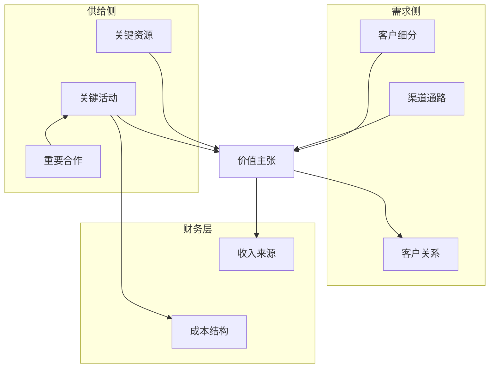
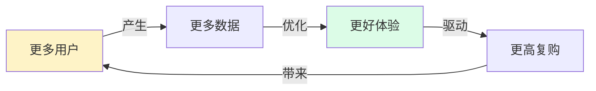

# 🎯 Business Model Canvas Agents

> **一个由 14 个虚拟专家组成的虚拟团队，专门做商业模式画布（Business Model Canvas）的深度诊断。**

[](./LICENSE)
[](./CHANGELOG.md)
[](#-14-角色天团)
[](#-贡献)

---

## 🧠 一句话定义

**BMC 不只是 9 个格子，而是一张咬合的齿轮图。**

本天团 = 9 个模块专家 + 3 个可行性穿透 + 1 个咬合度审查 + 1 个视觉翻译 = **立体的商业诊断体系**。

---

## 🏗️ 架构全景

```
          客户需求（想不想买？）
                  ↑
                  │
   市场可行性 ──→ 商业模式 ←── 交付可行性
   （能不能搭？）    │       （能不能跑？）
                  │
                  ↓
            9 模块基础分析（是什么？）
                  │
                  ↓
            🔬 咬合度检查
                  │
                  ↓
            🎨 视觉翻译
                  │
                  ↓
              📋 诊断书
```

---

## 🚀 快速开始（30 秒上手）

**3 个最常用命令**：

```bash
/bmc 完整诊断    # 全面体检（1-2 小时）→ 7 件套诊断书
/bmc 拍砖        # 新想法快速验证（10-15 分钟）→ 可行性三角评分
/bmc 客户需求    # 客户洞察 + JTBD（20-30 分钟）→ 客户旅程地图
```

**完整命令手册**：👉 [docs/commands.md](./docs/commands.md)（7 核心 + 10 快捷 + 3 上下文）

---

## 📦 7 件套交付物

每次完整诊断，老板会拿到：

| # | 交付物 | 内容 | 一句话用途 |
|---|--------|------|----------|
| 1 | 📊 **BMC 画布** | 9 宫格可视化 | 一页纸讲清商业模式 |
| 2 | 🧩 **9 模块分析卡** | 每模块深度解读 | 单点细节追问 |
| 3 | 🌍 **市场可行性报告** | 合作切入的市场评估 | 判断「能不能搭」 |
| 4 | ⚙️ **交付可行性报告** | 成本切入的飞轮分析 | 判断「能不能跑」 |
| 5 | 🎯 **客户需求洞察报告** | 客户切入的 JTBD 分析 | 判断「想不想买」 |
| 6 | 🔬 **健康度报告** | 模块咬合度 + 风险清单 | 判断「哪里有坑」 |
| 7 | 📋 **总指挥诊断书** | 优化建议 + 优先级路径 | 行动指南 |

---

## 👥 14 角色天团

### 🎖️ 顶层协调（2 角色）

| 角色 | 职责 | 工作准则 |
|------|------|---------|
| **总指挥 PMO** | 任务拆解 · 冲突裁决 · 最终整合 | [📄](./roles/orchestrator/PMO.md) |
| **逻辑审查官** | 模块咬合度检查 · 风险预警 | [📄](./roles/orchestrator/coherence-auditor.md) |

### 🌍 横向穿透 · 可行性三角（3 角色）

> 从特定模块切入，**透视整个商业模式**的可行性。

| 角色 | 切入口 | 核心追问 | 工作准则 |
|------|--------|---------|---------|
| **市场可行性专家** | 重要合作 | 市场有没有准备好接住这个模式？ | [📄](./roles/horizontal-experts/market-feasibility.md) |
| **交付可行性专家** | 成本结构 | 钱烧得值不值？飞轮转不转得起来？ | [📄](./roles/horizontal-experts/delivery-feasibility.md) |
| **客户需求分析专家** | 客户细分 | 客户真想买吗？他雇产品完成哪个 Job？ | [📄](./roles/horizontal-experts/customer-needs.md) |

### 🧩 垂直深挖 · 9 模块专家

> 每个模块独立深挖，输出标准化分析卡片。

| # | 角色 | 模块 | 核心追问 | 工作准则 |
|---|------|------|---------|---------|
| 1 | **CS** | 客户细分 | 我们到底在为谁服务？ | [📄](./roles/vertical-experts/customer-segments.md) |
| 2 | **VP** | 价值主张 | 客户凭什么选你不选别人？ | [📄](./roles/vertical-experts/value-propositions.md) |
| 3 | **CH** | 渠道通路 | 客户怎么知道我们？怎么买到？ | [📄](./roles/vertical-experts/channels.md) |
| 4 | **CR** | 客户关系 | 买完后如何留存、复购、推荐？ | [📄](./roles/vertical-experts/customer-relationships.md) |
| 5 | **RS** | 收入来源 | 钱从哪里来？用什么姿势收？ | [📄](./roles/vertical-experts/revenue-streams.md) |
| 6 | **KR** | 关键资源 | 这个模式跑起来，必须拥有什么？ | [📄](./roles/vertical-experts/key-resources.md) |
| 7 | **KA** | 关键活动 | 必须做对哪些事？ | [📄](./roles/vertical-experts/key-activities.md) |
| 8 | **KP** | 重要合作 | 谁必须站我们这边？ | [📄](./roles/vertical-experts/key-partnerships.md) |
| 9 | **CST** | 成本结构 | 钱烧在哪？哪里能优化？ | [📄](./roles/vertical-experts/cost-structure.md) |

### 🎨 视觉翻译（1 角色）

| 角色 | 职责 | 工作准则 |
|------|------|---------|
| **画布专家** | 用 mermaid 把诊断结果可视化 | [📄](./roles/visual-expert/canvas-artist.md) |

---

## 🎨 核心画布预览

画布专家产出的 5 种核心图：

### BMC 9 宫格



### 增长飞轮



更多画布模板见 [画布专家手册](./roles/visual-expert/canvas-artist.md)。

---

## 📚 完整文档

### 🎯 入门
- 📋 [触发命令手册](./docs/commands.md) — 7 核心 + 10 快捷 + 3 上下文命令
- 📋 [任务卡模板](./templates/task-card.md) — 提交诊断时填写
- 📋 [输出模板库](./templates/output-templates.md) — 标准化输出格式

### 🛠️ 工作流
- 🔄 [完整诊断工作流](./workflows/full-diagnosis-workflow.md) — 6 阶段 SOP

### 📖 方法论
- 🌍 [可行性三角](./docs/feasibility-triangle.md) — 三维穿透评估
- 🎯 [JTBD 客户需求分析](./docs/jtbd-methodology.md) — Jobs-to-be-Done 方法

### 💡 示例
- 🚀 [AI 简历优化订阅服务诊断案例](./examples/ai-resume-service.md) — 完整诊断示例

### 📦 其他
- 📝 [更新日志](./CHANGELOG.md)
- ⚖️ [MIT 许可证](./LICENSE)

---

## 🎯 三种使用方式

| 方式 | 命令 | 适用场景 | 耗时 |
|------|------|---------|------|
| **🎯 完整诊断** | `/bmc 完整诊断` | 新业务上线前、季度复盘、融资前自检 | 1-2 小时 |
| **🔍 专项诊断** | `/bmc 专项诊断 [模块]` | 具体问题快速突破 | 20-30 分钟 |
| **🚀 灵感触发** | `/bmc 拍砖` | 还在探索方向，没有定下来 | 10-15 分钟 |

详细使用指南见 [docs/commands.md](./docs/commands.md)。

---

## 💡 设计哲学

1. **垂直 + 横向双视角** —— 每个模块既被垂直深挖，又被横向穿透
2. **可行性三角** —— 客户需求 × 市场可行性 × 交付可行性 = 真伪判断
3. **视觉优先** —— 复杂结论必须可视觉化，画布专家只翻译不创造
4. **纪律明确** —— 每个角色有清晰的「输入/输出/陷阱」，避免角色越界
5. **咬合度检查** —— 逻辑审查官作为独立裁判，保证整体逻辑一致

> **90% 的商业模式失败，不是因为单个模块差，而是模块之间不咬合。**

---

## 🤝 贡献

欢迎贡献：

- 🆕 **新增行业场景的诊断示例**（[examples/](./examples/)）
- ✏️ **优化角色工作准则**（[roles/](./roles/)）
- 🎨 **增加更多 mermaid 模板**（[roles/visual-expert/](./roles/visual-expert/)）
- 📋 **完善输出模板库**（[templates/](./templates/)）

提交方式：PR 或 Issue。

---

## 📄 许可证

[MIT License](./LICENSE) — 自由使用、修改、分享。

---

## 🌟 Star History

如果这个项目对你有帮助，欢迎点 Star 支持一下 ⭐

---

<div align="center">

**🎯 14 角色天团 · 把商业决策从「拍脑袋」变成「可推演」**

[📖 命令手册](./docs/commands.md) · [📋 任务卡](./templates/task-card.md) · [💡 案例](./examples/ai-resume-service.md)

</div>
