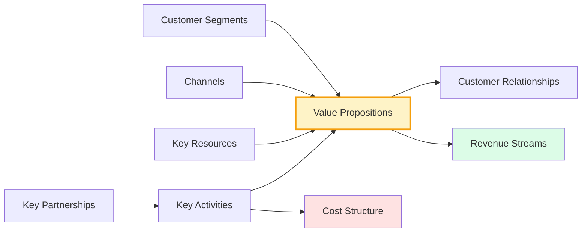
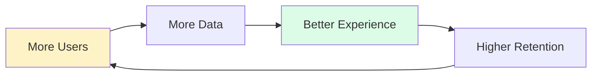

# 🎯 Business Model Canvas Agents

> **A 14-role virtual expert team for deep Business Model Canvas (BMC) analysis — vertical deep-dives, horizontal penetration, and visual translation in one cohesive system.**

[](./LICENSE)
[](./CHANGELOG.md)
[](#-the-14-role-team)
[](#-contributing)
[](./README.zh-CN.md)

> 📖 **Read in other languages**: [中文 (zh-CN)](./README.zh-CN.md)

---

## 🧠 In One Sentence

**A Business Model Canvas isn't 9 isolated cells — it's a set of interlocking gears.**

This team combines 9 module specialists + 3 feasibility penetrators + 1 coherence auditor + 1 visual translator = **a three-dimensional business diagnosis system**.

---

## 🏗️ Architecture

```
          Customer Needs (will they buy?)
                    ↑
                    │
   Market Feasibility ──→ Business Model ←── Delivery Feasibility
   (can we build it?)      │           (can we run it?)
                           │
                           ↓
                9-Module Deep Analysis (what is it?)
                           │
                           ↓
                🔬 Coherence Audit
                           │
                           ↓
                🎨 Visual Translation
                           │
                           ↓
                    📋 Diagnostic Report
```

---

## 🚀 Quick Start (30 seconds)

**3 most-used commands**:

```bash
/bmc full-diagnosis    # Complete health check (1-2h) → 7-piece diagnostic report
/bmc stress-test       # Quick validation of a new idea (10-15min) → feasibility triangle
/bmc customer-needs    # Customer insight + JTBD (20-30min) → customer journey map
```

**Full command manual**: 👉 [docs/commands.md](./docs/commands.md) (7 core + 10 shortcut + 3 contextual)

---

## 📦 The 7-Piece Deliverable

Each complete diagnosis produces:

| # | Deliverable | Content | One-line Use |
|---|-------------|---------|--------------|
| 1 | 📊 **BMC Canvas** | 9-cell visualization | Explain the business model on one page |
| 2 | 🧩 **9 Module Cards** | Deep dive on each module | Single-point deep questions |
| 3 | 🌍 **Market Feasibility Report** | Market assessment via partnerships | "Can we build it?" |
| 4 | ⚙️ **Delivery Feasibility Report** | Flywheel analysis via cost structure | "Can we run it?" |
| 5 | 🎯 **Customer Needs Report** | JTBD analysis via customer segments | "Do they want it?" |
| 6 | 🔬 **Health Report** | Module coherence + risk list | "Where are the gaps?" |
| 7 | 📋 **Orchestrator Report** | Optimization advice + priority path | Action guide |

---

## 👥 The 14-Role Team

### 🎖️ Top-Level Coordination (2 roles)

| Role | Responsibility | Charter |
|------|---------------|---------|
| **PMO Orchestrator** | Task decomposition · Conflict resolution · Final integration | [📄](./roles/orchestrator/PMO.md) |
| **Coherence Auditor** | Module coherence check · Risk warning | [📄](./roles/orchestrator/coherence-auditor.md) |

### 🌍 Horizontal Penetration · Feasibility Triangle (3 roles)

> Cut through the whole business model from a specific module entry point.

| Role | Entry Module | Core Question | Charter |
|------|--------------|---------------|---------|
| **Market Feasibility Expert** | Key Partnerships | Is the market ready to receive this model? | [📄](./roles/horizontal-experts/market-feasibility.md) |
| **Delivery Feasibility Expert** | Cost Structure | Is the money well spent? Does the flywheel spin? | [📄](./roles/horizontal-experts/delivery-feasibility.md) |
| **Customer Needs Expert** | Customer Segments | Do they really want it? What Job are they hiring it for? | [📄](./roles/horizontal-experts/customer-needs.md) |

### 🧩 Vertical Deep-Dive · 9 Module Specialists

> Each module analyzed independently with standardized output cards.

| # | Role | Module | Core Question | Charter |
|---|------|--------|---------------|---------|
| 1 | **CS** | Customer Segments | Who exactly are we serving? | [📄](./roles/vertical-experts/customer-segments.md) |
| 2 | **VP** | Value Propositions | Why do they pick us over alternatives? | [📄](./roles/vertical-experts/value-propositions.md) |
| 3 | **CH** | Channels | How do customers find us? How do they buy? | [📄](./roles/vertical-experts/channels.md) |
| 4 | **CR** | Customer Relationships | How do we retain, repurchase, and get referrals? | [📄](./roles/vertical-experts/customer-relationships.md) |
| 5 | **RS** | Revenue Streams | Where does the money come from? How is it collected? | [📄](./roles/vertical-experts/revenue-streams.md) |
| 6 | **KR** | Key Resources | What must we own to run this? | [📄](./roles/vertical-experts/key-resources.md) |
| 7 | **KA** | Key Activities | What must we do right? | [📄](./roles/vertical-experts/key-activities.md) |
| 8 | **KP** | Key Partnerships | Who must be on our side? | [📄](./roles/vertical-experts/key-partnerships.md) |
| 9 | **CST** | Cost Structure | Where does the money burn? Where to optimize? | [📄](./roles/vertical-experts/cost-structure.md) |

### 🎨 Visual Translation (1 role)

| Role | Responsibility | Charter |
|------|---------------|---------|
| **Canvas Artist** | Visualize diagnostic results with mermaid | [📄](./roles/visual-expert/canvas-artist.md) |

---

## 🎨 Canvas Preview

The Canvas Artist produces 5 core diagram types (see [Canvas Artist Charter](./roles/visual-expert/canvas-artist.md)):

### BMC 9-Cell



### Growth Flywheel



> 💡 **Tip**: If mermaid diagrams don't auto-render on GitHub, refresh the page (GitHub has render cache). All diagrams are tested with GitHub's official mermaid engine.

---

## 📚 Full Documentation

### 🎯 Getting Started
- 📋 [Command Manual](./docs/commands.md) — 7 core + 10 shortcut + 3 contextual commands
- 📋 [Task Card Template](./templates/task-card.md) — Fill this in to submit a diagnosis
- 📋 [Output Template Library](./templates/output-templates.md) — Standardized output formats

### 🛠️ Workflow
- 🔄 [Full Diagnosis Workflow](./workflows/full-diagnosis-workflow.md) — 6-phase SOP

### 📖 Methodology
- 🌍 [Feasibility Triangle](./docs/feasibility-triangle.md) — Three-dimensional penetration
- 🎯 [JTBD Customer Needs Analysis](./docs/jtbd-methodology.md) — Jobs-to-be-Done method

### 💡 Example
- 🚀 [AI Resume Optimization Service Case Study](./examples/ai-resume-service.md) — Complete diagnosis example

### 📦 Other
- 📝 [Changelog](./CHANGELOG.md)
- ⚖️ [MIT License](./LICENSE)
- 🌐 [中文文档](./README.zh-CN.md)

---

## 🎯 Three Usage Modes

| Mode | Command | Use Case | Duration |
|------|---------|----------|----------|
| **🎯 Full Diagnosis** | `/bmc full-diagnosis` | Pre-launch check, quarterly review, pre-funding self-audit | 1-2 hours |
| **🔍 Focused Diagnosis** | `/bmc focused-diagnosis [module]` | Quick breakthrough on a specific issue | 20-30 minutes |
| **🚀 Idea Validation** | `/bmc stress-test` | Early exploration, direction not yet decided | 10-15 minutes |

See [docs/commands.md](./docs/commands.md) for the complete guide.

---

## 💡 Design Philosophy

1. **Vertical + Horizontal Dual View** — Each module is both deep-dived vertically and penetrated horizontally
2. **Feasibility Triangle** — Customer Needs × Market Feasibility × Delivery Feasibility = truth check
3. **Visual First** — Complex conclusions must be visualizable; the Canvas Artist only translates, never invents
4. **Clear Discipline** — Each role has clear inputs/outputs/pitfalls to prevent role overlap
5. **Coherence Audit** — Independent auditor ensures overall logical consistency

> **90% of business model failures aren't because of a single weak module — they're because the modules don't interlock.**

---

## 🤝 Contributing

Contributions welcome:

- 🆕 **New industry case studies** ([examples/](./examples/))
- ✏️ **Improve role charters** ([roles/](./roles/))
- 🎨 **Add more mermaid templates** ([roles/visual-expert/](./roles/visual-expert/))
- 📋 **Expand output template library** ([templates/](./templates/))

Submit via PR or Issue.

---

## 📄 License

[MIT License](./LICENSE) — Free to use, modify, and share.

---

## 🌟 Star History

If this project helps you, a ⭐ would be appreciated!

---

<div align="center">

**🎯 The 14-Role Team · Turning "gut feel" business decisions into "simulatable" ones**

[📖 Command Manual](./docs/commands.md) · [📋 Task Card](./templates/task-card.md) · [💡 Example](./examples/ai-resume-service.md) · [中文文档](./README.zh-CN.md)

</div>
